# Etapa 1 - Importando bibliotecas

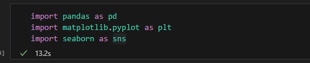

Na primeira etapa eu importo as bibliotecas pandas, matplotlib e a biblioteca seaborn para me auxiliar na construção do desafio e vou contar para que servem cada uma.

A biblioteca pandas é a ferramenta mais utilizada para análize de dados em python. Ele oferece estruturas de
dados eficientes e fáceis de usar, tornando a manipulação e a análise de grandes conjuntos muito mais simples.

O matplotlib é a biblioteca de visualização de dados mais popular em python. Ela oferece uma ampla gama de ferramentas para criar gráficos de alta qualidade, desde simples gráficos de linha até complexas visualizações em 3D.

Seaborn é uma biblioteca de visualização de dados em Python construida sobre o Matplotlib. Ela oferece uma interface de alto nível para criar gráficos estatísticos atraentes e informativo com muito mais facilidade do que o Matplotlib puro.

Essas três ferramentas com certeza foram essenciais para a conclusão do desafio.

# Etapa 2 - Tratando o arquivo csv.

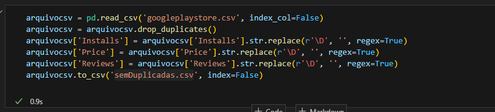

Ne segunda etapa eu começo a tratar os dados do arquivo "googleplaystore.csv". Primeiramente eu leio o arquivo "googleplaystore.csv" utilizando uma funcionalidade da biblioteca pandas "pd.read_csv()", a partir da leitura do arquivo eu crio uma variável chamada "arquivocsv" e coloco o DataFrame dentro dessa variável.
Posteriomente eu utilizo a funcão "drop.duplicates()" que retira todas as linhas duplicadas do meu arquivocsv.
A partir daí eu pensei que estava tudo bem pra continuar, até que no primeiro passo depois daí eu já encontrei um erro, quando eu fui fazer o top 5 de apps mais instalados a forma que eu estava fazendo não permitia que eu vizualizasse da forma correta os 5 apps. Então, eu percebi que precisava fazer uma limpeza na coluna "Installs", aí eu voltei pra parte de tratamento da tabela e adicionei a seguinte linha "arquivocsv['Installs'] = arquivocsv['Installs'].str.replace(r'\D', '', regex=True)", assim eu removi os caracteres especiais como "+" e espaços em branco, tendo assim apenas números para trabalhar. Mais pra frente, no decorrer do desafio eu também tive alguns problemas parecidos com a coluna "Price" e a coluna "Reviews", então eu fiz o mesmo tratamento. Depois de tratar todos esses dados eu os coloque dentro de um arquivo csv chamado "semDuplicatas.csv", e com esse arquivo que eu trabalhei durante todo o desafio.

# Etapa 3 - Criando um gráfico de barras.

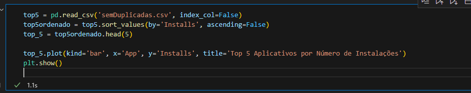

Na terceira etapa eu começo a parte de criar gráficos, mas primeiramente eu mecho um pouco nos dados da minha tabela. Primeiro eu abro o "semDuplicatas.csv" e coloco dentro da variável "top5". depois eu ordeno a coluna "Installs" em ordem decrescente e coloco dentro da variável "top5ordenado", depois disso tudo, eu limito em 5 linhas minha variável "top5ordenado" utilizando a função "head(5)". A parte de tratamento agora está toda concluída, agora vamos para o gráfico. Eu inicio com o método ".plot()" para iniciar a criação do meu gráfico, dentro do método eu tenho "kind'bar'" que é o tipo de gráfico que eu quero utilizar, "x='App'" é o que vai aparecer no eixo x do meu gráfico, nesse caso será a coluna de apps, "y='Installs' é o que eu vou inserir no eixo y, que nesse caso é a coluna "Installs" e por fim eu tenho o título do gráfico que está representado por "title='Top 5 Aplicativos por Número de Instalações'". Agora o meu gráfico está criado, e no final eu só precisei dar um "plt.show()" para o gráfico ser imprimido na tela. O gráfico ficou assim:

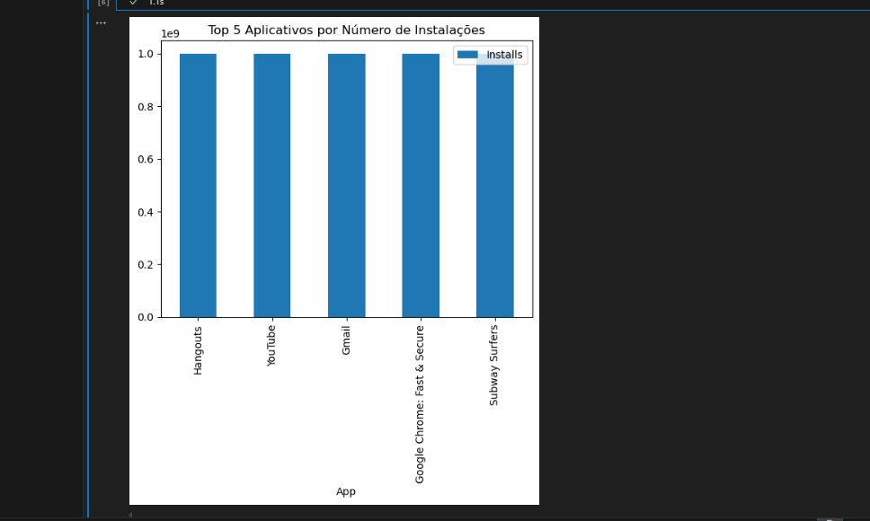

Uma coisa que eu tentei fazer e não consegui nessa etapa foi não conseguir mostrar os números de Installs no eixo y, não sei se ficou correto da forma que está.

# Etapa 4 - Criando um gráfico de pizza.

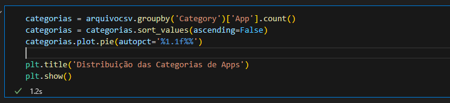

Na etapa 4, foi criado um gráfico de pizza mostrando as categorias de apps ordenados de acordo com a frequêqncia em que aparecem, comecei agrupando pela a coluna "Category" utilizando o método ".groupby()" e depois eu faço a contagem dos apps por cada categoria utilizando o ".count()". Dessa forma, eu conto quantos apps tem em cada categoria e jogo tudo dentro da variável "categorias".
Logo após, eu ordeno minha variável "categorias" utilizando o "sort_values()" e deixo ordenada de forma decrescente utilizando o "ascending=False". Todos os dados tratados, agora foi a hora de criar o gráfico.
Primeiro eu uso o ".plot" para avisar o Python que eu quero visualizar em formato de gráfico, depois eu utilizo o ".pie" que é o tipo de gráfico que eu quero utilizar, nesse caso é um gráfico de pizza. Depois eu formato os valores que serão exibidos em cada fatia de pizza utilizando o "autopct='%1.1f%%'", o "autopct" significa que eu quero exibir as porcentagens em cada fatia, "'%1.1f%%'" define o formato da porcentagem que eu quero exibir, "%" está indicando que eu quero exibir um valor percentual, "1f" define a quantidade de somente uma casa decimal após a vírgula. Após isso, eu crio o título do gráfico com o "plt.title()", e dou um "plt.show()" para que o gráfico seja exibido na tela. O gráfico ficou assim:

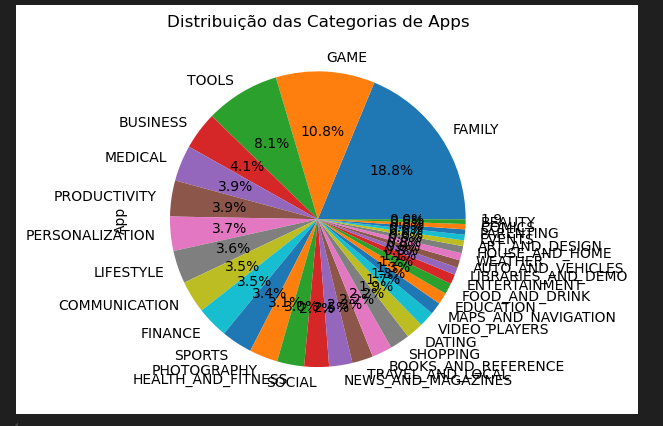

Eu tentei encrontrar alguma forma de fazer com que os nomes das categorias não ficassem um por cima do outro, eu pensei em agrupar os que tem menos de 3% de porcentagem e colocar o nome de "outros" neles, mas não tive sucesso.

# Etapa 5 - Procurando o app mais caro do dataseat.

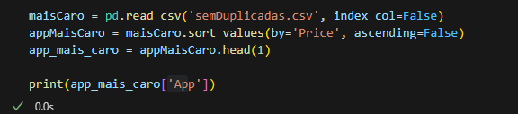

Na quinta etapa eu tive que procurar dentro do dataseat qual era o app mais caro, essa foi uma etapa que eu demorei muito pra fazer, pois a coluna "Price" do arquivo "googleplaystore.csv" era uma das colunas que eu não tinha tratado da forma correta antes de jogar dentro de "semDuplicatas.csv", na coluna os valores ainda tinham alguns caracteres especias como vírgulas ou "+", então eu voltei lá pra parte onde eu tratei o arquivo "googleplaystore.csv" e e fiz esse processo, deixando a coluna apenas com valores numéricos. A partir daí foi dando tudo certo, primeiro eu lí o arquivo "semDuplicatas.csv" e joguei dentro da variável "maisCaro", depois eu peguei minha variável "maisCaro" e ordenei pelo preço utilizando o método "sort_values()" e ordenei por ordem decrescente utilizando o "ascending=False" e joguei tudo isso dentro da variável "appMaisCaro", depois de ordenar tudo eu utilizo o "head(1)" na minha variável para pegar apenas a primeira linha e coloco dentro de "app_mais_caro", depois disso eu só printo o "app_mais_caro" utilizando o índice "['App']" para que apareça apenas o nome do aplicativo. O resultado foi o seguinte:

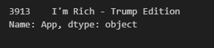

# Etapa 6 - Apps classificados como Mature 17+

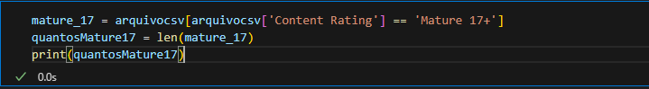

Na etapa 6, eu procurei dentro do dataseat quantos aplicativos estão classificados como 'Mature 17+', primeiro eu procuro dentro do meu "arquivocsv" na coluna "['Content Rating']" todos os apps que estão classificados como "Mature 17+", se a condição for True, eu jogo dentro da minha variável "mature_17", se a condição for False, eu pulo para a outra linha e a verifico. Depois disso eu dou um "len()" na minha variável "mature_17", ao fazer isso, eu estou contando quantas linhas restaram no meu arquivo, lembrando que agora eu só tenho apps classificados como "Mature 17+" lá dentro, depois eu jogo essa soma dentro da variável "quantosMature17" e a printo na tela. O resultado do total de apps classificados como 'Mature 17+' for esse:

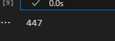

# Etapa 7 - Top 10 apps classificados pelo número de reviews.

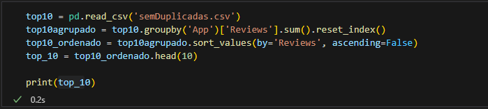

Na etapa 10, eu ordenei os 10 apps com maior números de reviews e eles foram ordenados pelo número de reviews. Eu comecei lendo o arquivo "semDuplicatas.csv" e colocando dentro de "top10", depois eu agrupei a coluna "['App']", quando eu printava na tela a coluna "Reviews", alguns aplicativos se repitiam, pois estavam como a quantidade de reviews separadas, então eu resolví dar um ".sum()" na coluna "Reviews" para somar as reviews dos aplicativos que estivessem separados. Depois de fazer isso eu joguei tudo dentro da variável "top10agrupado", a partir daí, eu comecei a parte da ordenação. Primeiro eu ordenei a coluna "Reviews" utilizando o método "sort_values()", depois eu deixei em ordem decrescente utilizando o "ascending=False", joguei tudo isso dentro da variável "top10_ordenado" e depois peguei as 10 primeiras linhas da minha variável "top10ordenado" utilizando o método "head(10)". Depois foi só printar na tela e o resultado foi o seguinte:

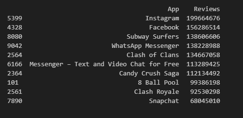

Nessa etapa eu também tive dificuldade para pegar os valores numéricos corretamente da coluna "Reviews", então fiz o mesmo tratamento que havia feito anteriormente nas colunas "Installs" e na coluna "Price".

# Etapa 8 - Criar mais dois cáuculos.

Na etapa 8, foi pedido para que eu criasse mais dois cálculos sobre o dataseat. Os dois cáuculos que eu criei foram os seguintes:

## Top 10 apps mais caros existentes no dataseat.

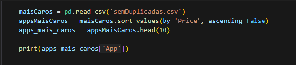

No primeiro cálculo eu criei uma lista com o top 10 de apps mais caros existentes no dataseat. Eu começo lendo o arquivo "semdDuplicatas.csv", depois eu jogo dentro da variável "maisCaros", depois disso, eu ordeno do mais caro para o menos caro dentro do top 10, pra fazer isso eu utilizei o método "sort_values()" ordenando a coluna "Price", e para ordenar de forma decrescente eu utilizei o "ascending=False" e joguei tudo isso dentro da variável "appsMaisCaros". Aí foi so pegar as 10 primeiras linhas do arquivo tratado utilizando o "head(10)" e printar na tela. O resultado ficou assim:

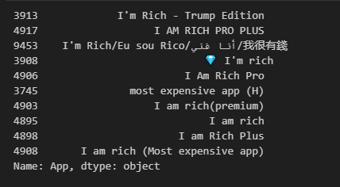

## Top 100 apps pior avaliados.

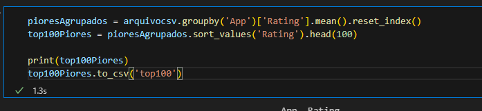

No segundo cálculo eu criei uma lista com o top 100 de apps pior avaliados. Eu comecei agrupando o "arquivocsv" pela coluna "['App']", depois peguei a média do "['Rating']" e coloquei dentro da variável "pioresAgrupados", aí eu ordenei a variável "pioresAgrupados" em ordem crescente pelo "['Rating']" que já foi tratado acima e já aproveito para pegar as 100 primeiras linhas utilizando o método ".head(100)", depois disso foi só printar na tela, mas quando eu printei não apareceram os 100, aparecem os primeiros, aí dá um intervalo e depois os últimos. Para uma melhor visualização eu coloquei dentro de um arquivo csv.

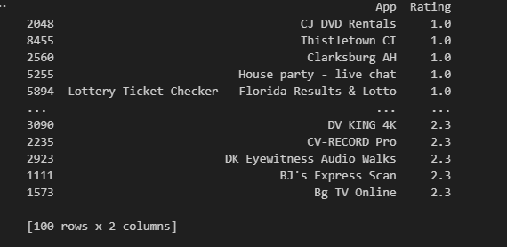
[csv top 100](top100)

# Etapa 9 - Criar gráficos para os dois cálculos que foram pedidos.

Na etapa 9 foi pedido para criar gráficos para melhor visualização dos dois cálculos que foram solicitados na etapa 8, eu criei os gráficos da seguinte forma:

## Top 10 apps mais caros no dataseat (gráfico de barras deitadas).

Para os top 10 apps mais caros do dataseat eu utilizo um gráfico de barras deitadas. no início eu utilizo o mesmo código dos top 10 apps mais caros e só implemento as linhas de código para mostrar isso em formato de gráfico. Eu começo com o "plt.barh()" que é a função do Matploitlib para criar gráficos de barras deitadas, depois eu seleciono a coluna "['App']" da variável apps_mais_caros e crio uma lista de número de 1 a 10 com o "range(1, 11)"(excluindo o 11), essa lista define a posiçãode cada barra no gráfico de barras deitadas. Depois eu adiciono um rótulo ao eixo x, informando que ele representa a "Posição" no ranking dos aplicativos mais caros, aí eu também adiciono um rótulo para o eixo y, informando que ele representa o "Aplicativo". Eu também adicionei um título para o gráfico utilizando o "plt.title()" e inverti a ordem das labels do eixo y, posicionando o aplicativo mais caro no topo do gráfico. Depois disso eu só dei um "plt.show()" para exibir o resultado na tela, e o resultado do gráfico foi esse:

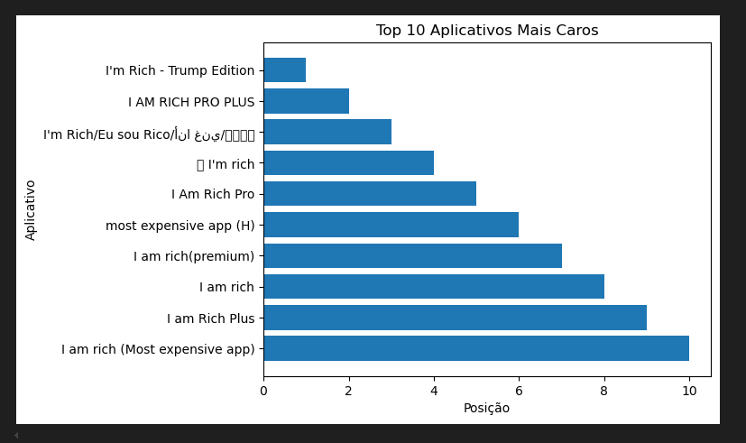

Como pode ver, os números da posição de cada aplicativo não estão aparecendo da forma que eu acho que deveriam, eles pulam de dois em dois. Eu tentei encontrar uma forma de aparecer um por um, mas não tive sucesso.

## Top 100 apps pior avaliados (gráfico de violino).

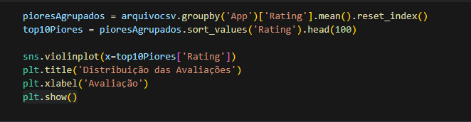

Para os top 100 apps pior avaliados eu utilizei um gráfico de violino. Eu começo no código anterior dos apps com a pior avaliação e implemendo o código para gerar o gráfico de violino. Primeiro eu uso a função "sns.violinplot()" da biblioteca seaborn para criar o gráfico, nele tem um único eixo x que foi onde eu coloquei o DataFrame "top100piores" e a coluna "['Rating']", depois eu só adiciono um título para o gráfico e um nome para os números chamado de "Avaliação". Aí foi só imprimir na tela com o "plt.show()". O resultado ficou assim:

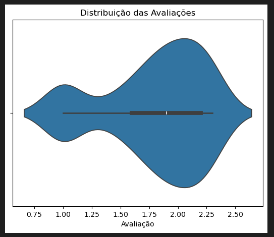

# E essa foi a minha execução de desafio, espero que esteja perto do esperado.
