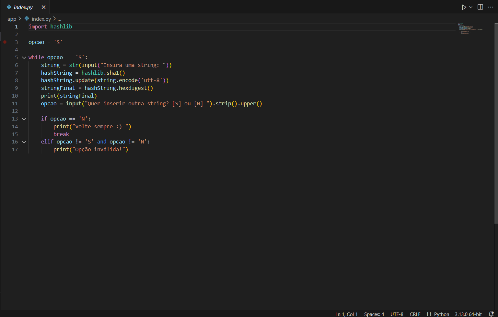
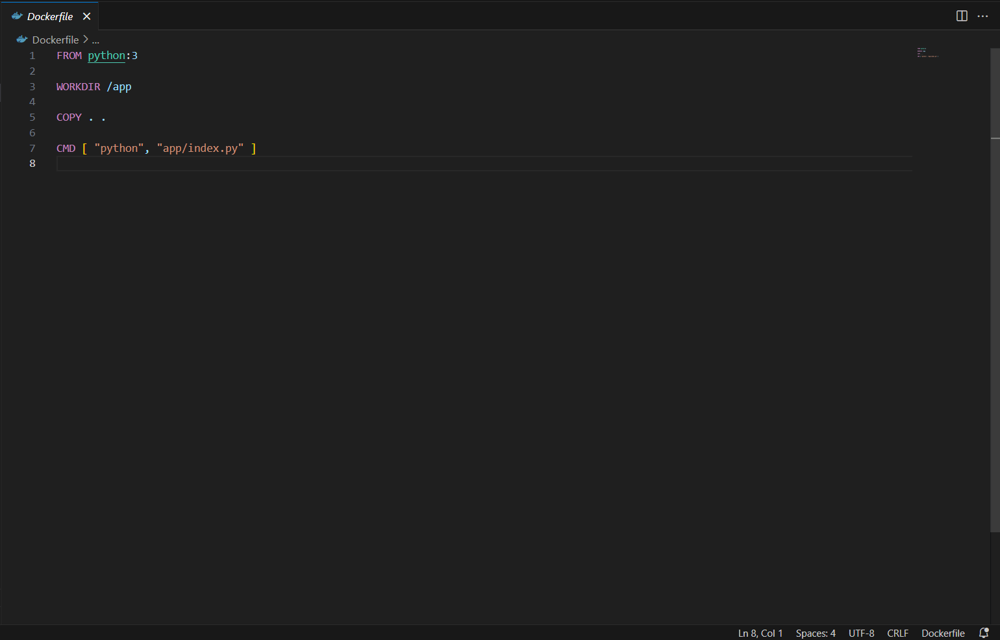
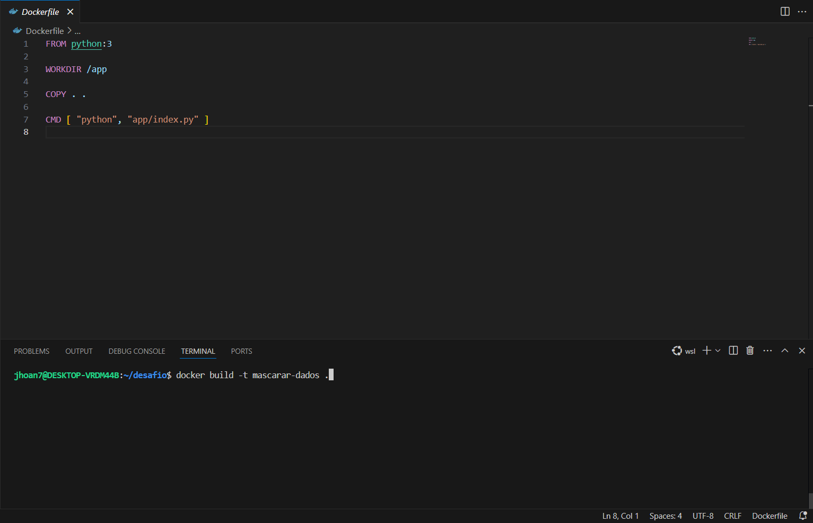
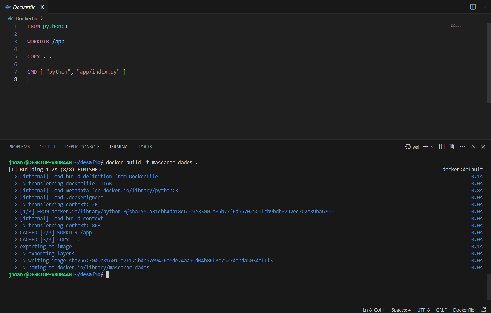
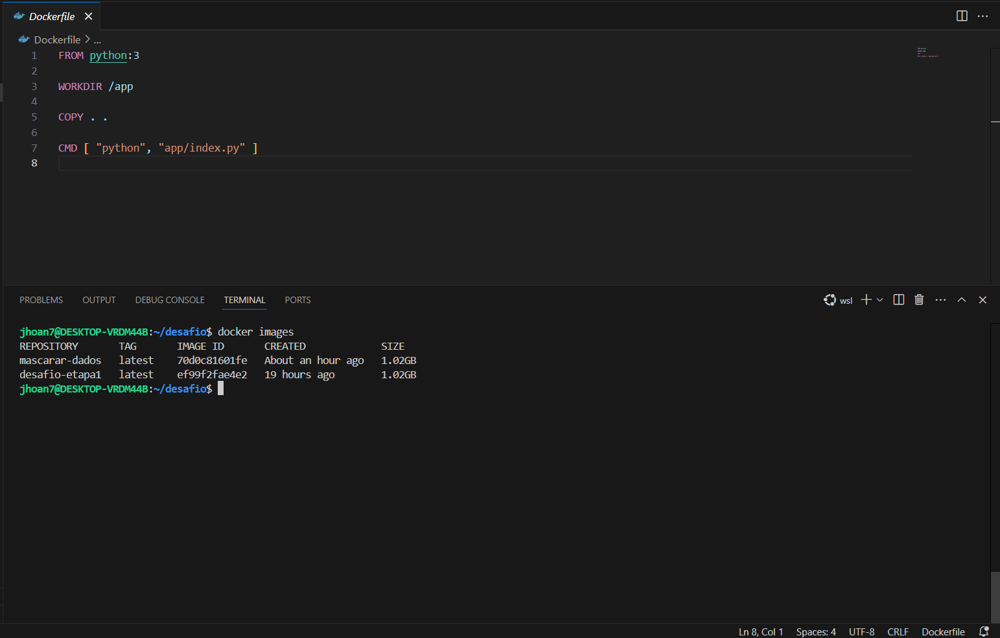
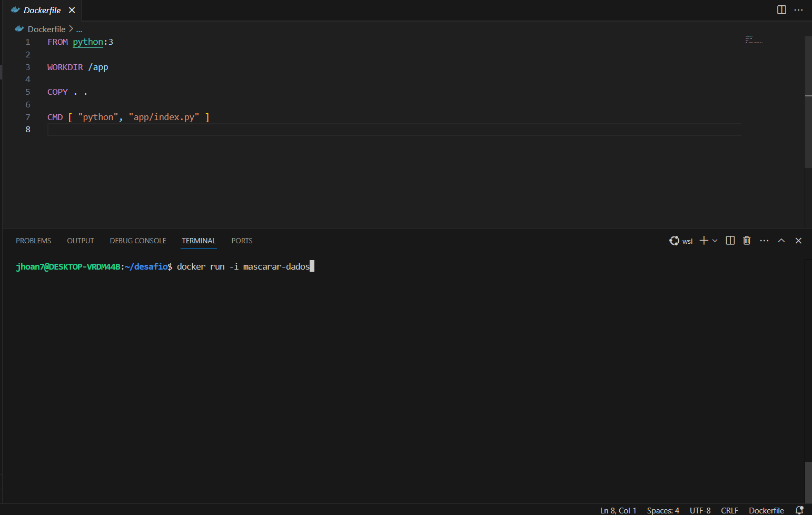
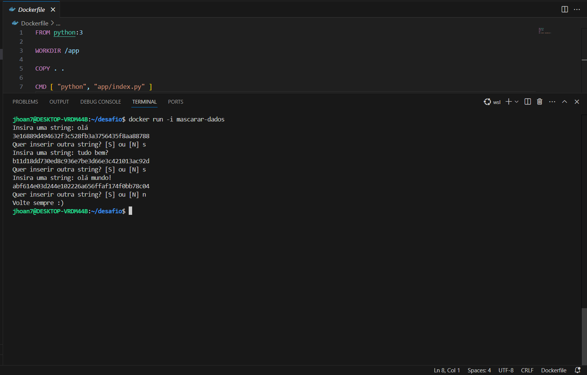
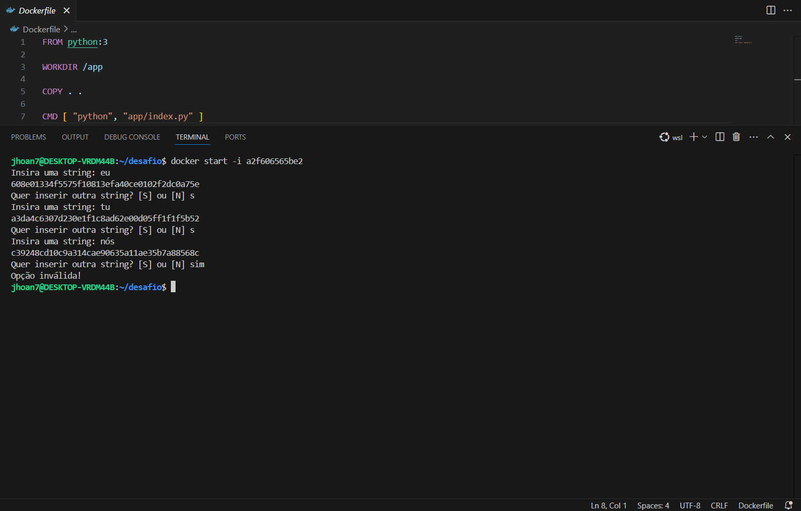
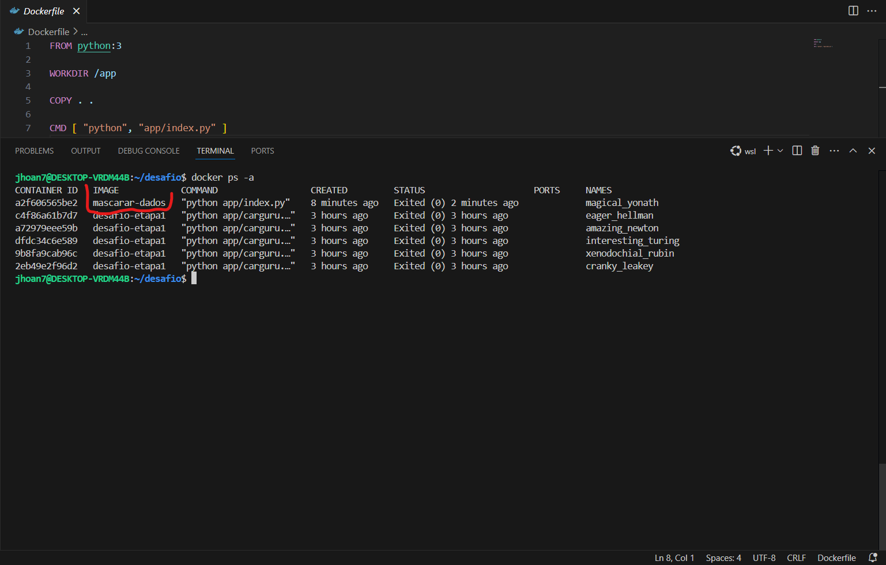
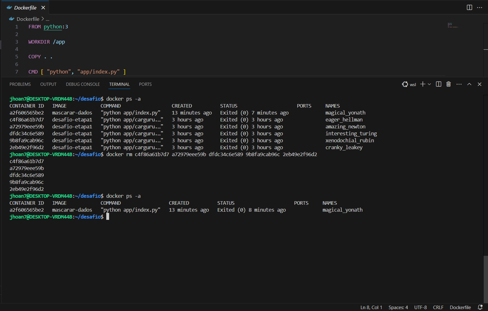

# Divisão do desafio.

Eu resolvi dividir a pasta do desafio em duas subpastas. Na pasta "[desafio1](desafio1)", eu fiz a parte do desafio que pede pra construir uma imagem que execute o código do arquivo disponibilizado na plataforma da Udemy "carguru.py". Já na pasta "[desafio2](desafio2)", eu fiz a parte onde pede que eu faça um script python que recebe uma string via input, gere seu hash e o imprima na tela, depois criar uma imagem que execute esse script e por fim iniciar um container a partir da imagem criada.

Todos os detalhes de cração de script até inicialização de containers estão no decorrer do README.

# Etapa 1 - Imagem que executa o "carguru.py".

## Estrutura de pastas

Na primeira etapa do desafio eu começo criando a estrutura de pastas e arquivos. Primeiro eu criei o arquivo "Dockerfile", nele que eu coloco a sequência de instruções que o Docker executará para construir a minha imagem. Em seguida eu criei a pasta app para armazenar o arquivo que contem o meu script e também para usar como caminho para o Docker. Por fim eu copiei o arquivo "carguru.py" que foi disponibilizado através da plataforma da Udemy para dentro da pasta "app".

## Arquivo "carguru.py".

Dei uma analisada no arquivo "carguru.py" e percebi que ele é um script para sortear qual carro o usuário deve dirigir. Ele começa importando a biblioteca "random" que é uma ótima biblioteca para realizar operações relacionadas a aleatoriedade. Depois cria uma lista contendo vários modelos de carros com suas respectivas marcas, pega essa lista e implementa a funcão "choice" nela que serve para escolher um elemento aleatório dentro da lista e joga tudo isso dentro da variável "random_carros". Após tudo isso só printa na tela qual carro o usuário deve dirigir. 

## Arquivo "Dockerfile".

No arquivo Dockerfile eu começo pelo "FROM" que define a imagem base a partir da qual eu irei construir a minha imagem, no meu caso, o python:3. No próximo passo eu usei o "WORKDIR", ele define o diretório de trabalho dentro da imagem, todos os comandos a seguir serão executados nesse diretório, no meu caso é a pasta "app", onde está o arquivo "carguru.py". Posteriormente vem o comando "COPY", ele tem a função de copiar arquivos do ambiente local para a imagem que está sendo construída, no meu caso eu estou copiando tudo e levando para a raiz do projeto. E por fim eu uso o "CMD" e dou o caminho para ele executar o meu script.

## Criando imagem.

Para criar a imagem eu começo com o "docker build" que é o comando principal pra construir uma nova imagem a partir eu um Dockerfile, ele lê as instruções do Dockerfile linha por linha e executa cada uma delas para criar a imagem. O "-t" é uma flag que eu utilizei para por um nome na a imagem que eu irei criar. O "desafio-etapa1" é o nome que eu criei para a minha imagem. Por fim, este ponto não final não é pra dizer que acabou a "frase", ele está indicando que eu quero executar o build a partir do meu diretório atual

Na imagem acima, temos o build sendo executado sem nenhuma interrupção ou erro.

## Executando container.

Na imagem acima eu tenho o container sendo executado várias vezes, o que não é uma boa prática, pois a cada execução eu crio um novo container e assim consumo mais a máquina em que estou trabalhando e poluo o ambiente de trabalho.
Para executar o container primeiro eu utilizo o "docker run", que é o comando principal para executar containers. A flag "-it" aloca um pseudo-terminal interativo para o container, isso me deixa enviar comandos e receber saídas do container em tempo real. Por fim o "desafio-etapa1" é o nome da imagem que eu quero executar, a mesma que eu criei anteriormente.

# Etapa 2 - É possível reutilizar containers?

A resposta é sim! como citei no tópico anterior, se eu der um "docker run" ele vai iniciar o container normalmente, mas a cada "docker run" um novo container será criado.

Na imagem acima eu criei vários containers com a mesma imagem e no final dei um "docker ps -a" para listar os containers criados, e lá estão todos os containers que eu criei através do "docker run", se eu de um "docker images" eu vou ver que eu só tenho uma imagem criada, e no print anterior eu tenho vários conteiners criados através dela.

Para resolver esse problema é muito simples, eu só preciso usar um "docker start -i <id-do-container>".

Desta forma o container que foi iniciado anteriormente será reutilizado.

# Etapa 3 - Exercitando a criação de um container.

## O que faz o script?

Na etapa 3 eu começo criando o meu script no python, esse script manda o usuário inserir uma string, quando ele inserir vai ser gerado o hash da string  e imprimido na tela. Após isso, vai aparecer uma mensagem para o usuário decidir se ele quer ou não adicionar outra string, ele tem as opções de escolher "S" ou "N". Caso ele escolha "S", o script será executado novamente até ele ser perguntado se quer inserir outra string. Caso escolha "N", aparecerá uma mensagem na tela dizendo "Volte sempre :)". Caso ele digite qualquer outra coisa, a mensagem que aparecerá na tela será "Opção inválida!", eu tentei de alguma forma fazer voltar pro loop e ele escolher novamente uma opção, mas não tive sucesso.

## Explicando o código.

Primeiro eu importo a biblioteca "hashlib" que é essencial pra execução do desafio, depois eu crio uma variável chamada "opcao" que recebe a condição "S" para poder dar início no while e o usuário poder digitar a primeira string. Após isso eu crio um "while" que diz que se a minha variável "opcao" for igual a "S" eu posso entrar no loop, como é uma condição verdadeira o script entra no loop. Depois eu peço para o usuário inserir uma string através de um input, pra ter certeza eu converto o que o usuário digitou para string utilizando o "str" antes do input e jogo tudo isso dentro da variável "string". Após isso eu começo a calcular o hash da string, primeiro eu crio um novo objeto pra calcular o hash por meio do algoritmo "SHA-1", depois eu codifico a string para "UTF-8" que é um formato padrão de codificação de caracteres, depois eu atualizo o objeto hash utilizando o método "update()" que adiciona a string codificada ao objeto hash, por fim, eu retorno a representação hexadecimal do hash calculado utilizando o método "hexdigest()" e jogo tudo isso dentro da variável "stringFinal". Após tudo isso eu utilizo o "print" pra imprimir o resultado do hash através da variável "stringFinal". Depois eu crio outro input perguntando se o usuário quer inserir outra string e dou a opção dele escolher "S" ou "N" e coloco um ".strip()" no final para ignorar qualquer espaço que o usuário pode ter colocado na sua resposta e também um ".upper()" para caso o usuário tenha respondido com uma letra minúscula, ela será convertida para maiúscula. A partir daí eu verifico com o "if" se o usuário digitou "N", se sim, aparecerá uma mensagem para ele dizendo "Volte sempre :)" e o "break" encerra o script, se não, a próxima condição é verificada. Na próxima condição eu utilizo um "elif" verificando se o usuário digitou algo diferente(!=) de "S" e diferente de "N", se sim, aparecerá uma mensagem na tela dizendo "Opção inválida". Por fim, caso o usuário digite "S", o while será executado novamente até o usuário ser perguntado de novo.

## Arquivo Dockerfile.

Na imagem acima temos o arquivo Dockerfile que contem todos os comandos para a criação da minha imagem, ele é identico ao arquivo que eu criei no passo 1.

## Criando a imgem mascarar-dados.

Na imagem acima temos os comando utilizados no terminal para a criação da imagem mascarar-dados.

Agora vimos a imagem sendo criada com nenhuma interrupção por erros ou falhas.

Aqui eu dei um docker images para mostra que a imagem "mascarar-dados" foi realmente criada.

## Iniciando container a partir da imagem "mascarar-dados".

Acima temos o comando de inicialização do container a partir da imagem "mascara-dados" que foi criada.

Acima temos algumas funcionalidades do container sendo executado.

Agora eu reutilizei o container com o "docker start" e usei outra funcionalidade dele.

Por fim eu dei um "docker ps -a" para mostrar que apenas um container foi iniciado a partir da imagem "mascarar-dados".

No final eu dei um "docker rm <id-dos-containers>" para remover os containers antigos que eu não utilizarei mais.

# E essa foi a minha execução do desafio, aprendi muita coisa que achei interessante e espero ter executado o desafio da forma correta.
