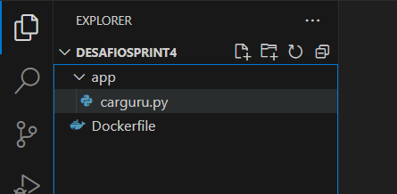
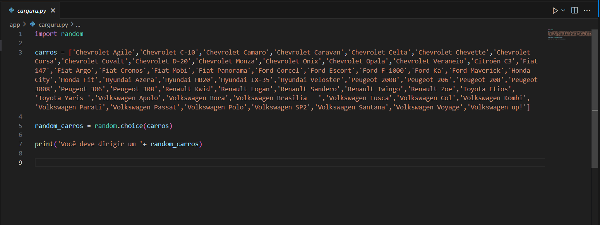
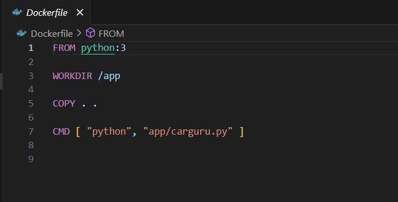
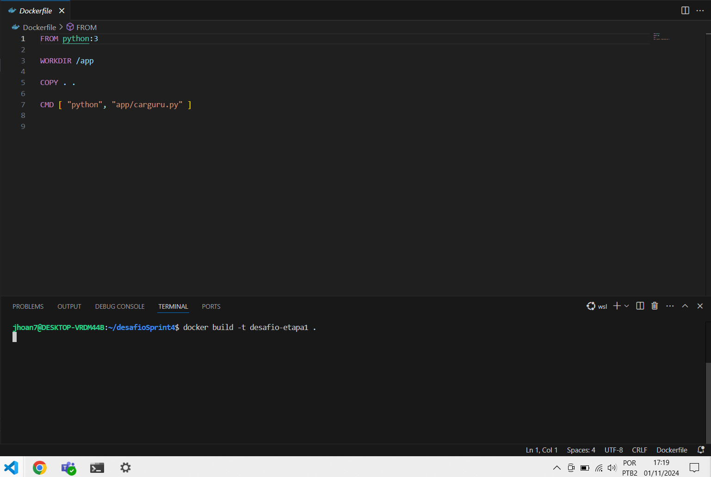
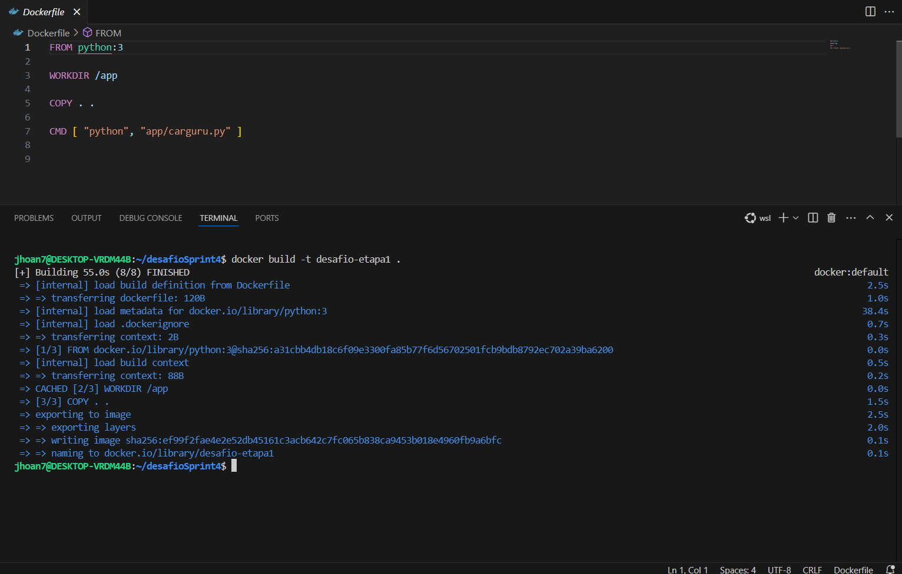
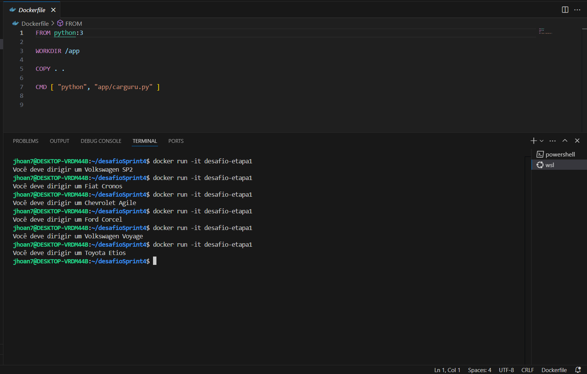
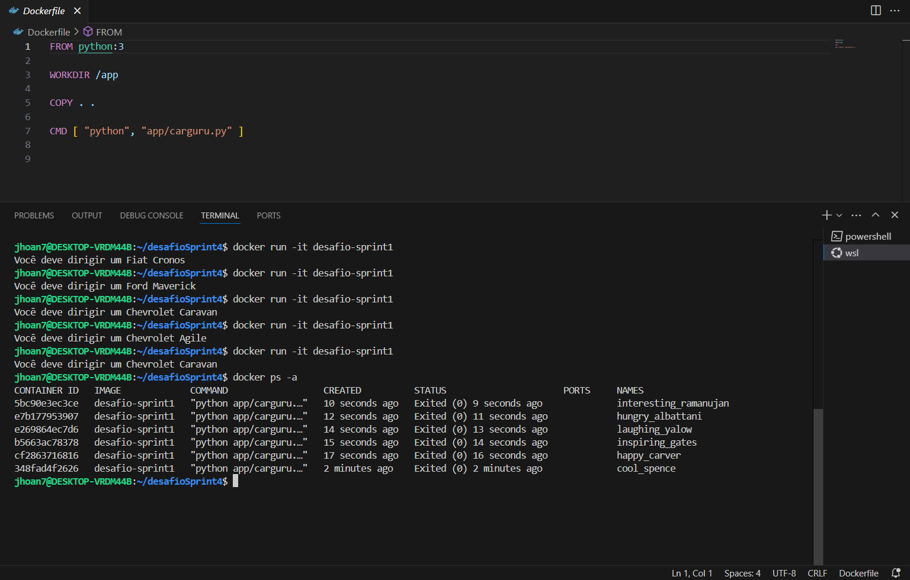
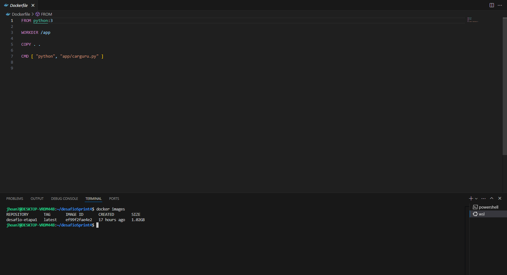
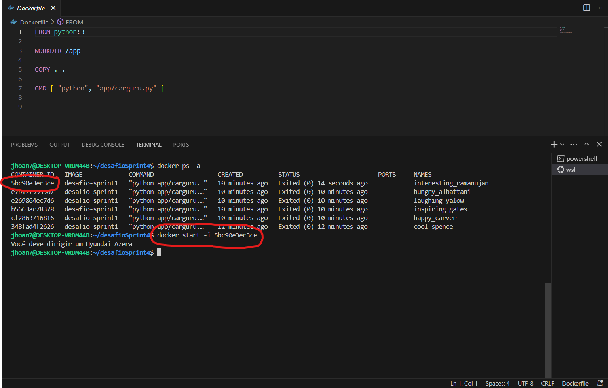

# Etapa 1 - Imagem que executa o "carguru.py".

## Estrutura de pastas

Na primeira etapa do desafio eu começo criando a estrutura de pastas e arquivos. Primeiro eu criei o arquivo "Dockerfile", nele que eu coloco a sequência de instruções que o Docker executará para construir a minha imagem. Em seguida eu criei a pasta app para armazenar o arquivo que contem o meu script e também para usar como caminho para o Docker. Por fim eu copiei o arquivo "carguru.py" que foi disponibilizado através da plataforma da Udemy para dentro da pasta "app".

## Arquivo "carguru.py".

Dei uma analisada no arquivo "carguru.py" e percebi que ele é um script para sortear qual carro o usuário deve dirigir. Ele começa importando a biblioteca "random" que é uma ótima biblioteca para realizar operações relacionadas a aleatoriedade. Depois cria uma lista contendo vários modelos de carros com suas respectivas marcas, pega essa lista e implementa a funcão "choice" nela que serve para escolher um elemento aleatório dentro da lista e joga tudo isso dentro da variável "random_carros". Após tudo isso só printa na tela qual carro o usuário deve dirigir. 

## Arquivo "Dockerfile".

No arquivo Dockerfile eu começo pelo "FROM" que define a imagem base a partir da qual eu irei construir a minha imagem, no meu caso, o python:3. No próximo passo eu usei o "WORKDIR", ele define o diretório de trabalho dentro da imagem, todos os comandos a seguir serão executados nesse diretório, no meu caso é a pasta "app", onde está o arquivo "carguru.py". Posteriormente vem o comando "COPY", ele tem a função de copiar arquivos do ambiente local para a imagem que está sendo construída, no meu caso eu estou copiando tudo e levando para a raiz do projeto. E por fim eu uso o "CMD" e dou o caminho para ele executar o meu script.

## Criando imagem.

Para criar a imagem eu começo com o "docker build" que é o comando principal pra construir uma nova imagem a partir eu um Dockerfile, ele lê as instruções do Dockerfile linha por linha e executa cada uma delas para criar a imagem. O "-t" é uma flag que eu utilizei para por um nome na a imagem que eu irei criar. O "desafio-etapa1" é o nome que eu criei para a minha imagem. Por fim, este ponto não final não é pra dizer que acabou a "frase", ele está indicando que eu quero executar o build a partir do meu diretório atual

Na imagem acima, temos o build sendo executado sem nenhuma interrupção ou erro.

## Executando container.

Na imagem acima eu tenho o container sendo executado várias vezes, o que não é uma boa prática, pois a cada execução eu crio um novo container e assim consumo mais a máquina em que estou trabalhando e poluo o ambiente de trabalho.
Para executar o container primeiro eu utilizo o "docker run", que é o comando principal para executar containers. A flag "-it" aloca um pseudo-terminal interativo para o container, isso me deixa enviar comandos e receber saídas do container em tempo real. Por fim o "desafio-etapa1" é o nome da imagem que eu quero executar, a mesma que eu criei anteriormente.

## É possível reutilizar containers?

A resposta é sim! como citei no tópico anterior, se eu der um "docker run" ele vai iniciar o container normalmente, mas a cada "docker run" um novo container será criado.

Na imagem acima eu criei vários containers com a mesma imagem e no final dei um "docker ps -a" para listar os containers criados, e lá estão todos os containers que eu criei através do "docker run", se eu de um "docker images" eu vou ver que eu só tenho uma imagem criada, e no print anterior eu tenho vários conteiners criados através dela.

Para resolver esse problema é muito simples, eu só preciso usar um "docker start -i <id-do-container>".

Desta forma o container que foi iniciado anteriormente será reutilizado.