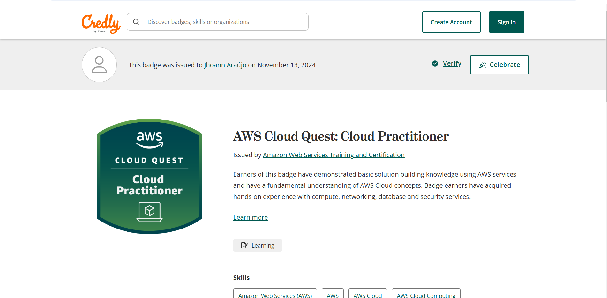

# Certificados

Na sprint 5, tivemos um corso na aws bem legal que foi o cloud quest, ele não nos deu um certificado, apenas o seguinte emblema:

Também tivemos um curso de preparação para a prova da AWS e tiramos o seguinte certificado:

[text](certificados/preparacaoAWS.pdf)

# Desafio

Tivemos um desafio um pouco atípico, onde colocamos a mão na massa direto pela plataforma da AWS, o meu desafio foi executado da seguinte maneira:

[text](desafio)

# Evidências

Na minha pasta de evidências tem duas pastas dentro dela uma é a pasta de evidências do desafio que estão todas explicadas no Readme do desafio:

[text](evidencias/printsDesafio)

A outra são alguns prints de etapas do exercíco sendo executado:

[text](evidencias/printsExercicios)

# Exercícios

A minha pasta de exercícios contém apenas os prints das etapas do exercício e o html disponibilizado, como não tinha nenhum arquivo para criar nem nada do tipo eu resolví fazer apenas isso:

[text](exercicios/printsExercicios)

[text](exercicios/html)

# Esse é o meu README da Sprint5.