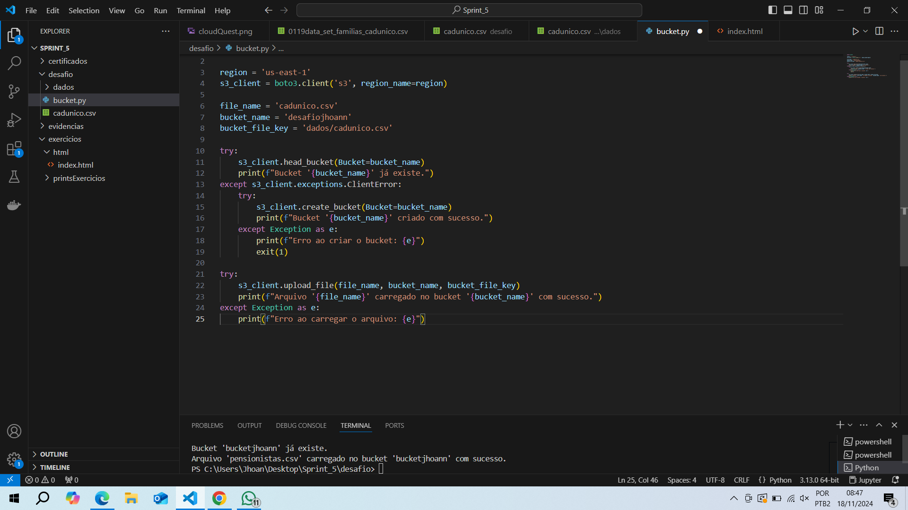
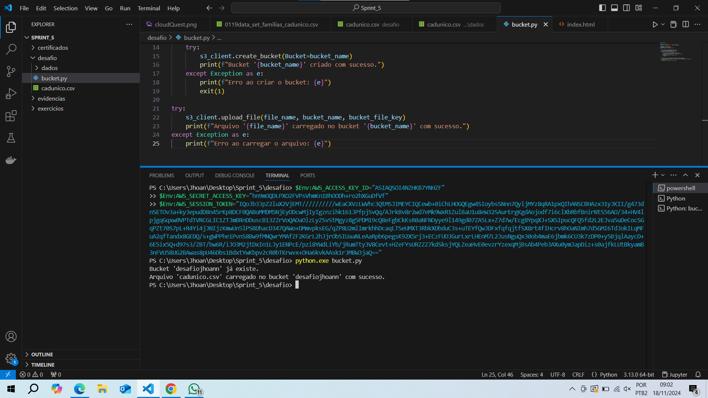
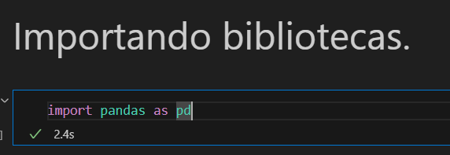
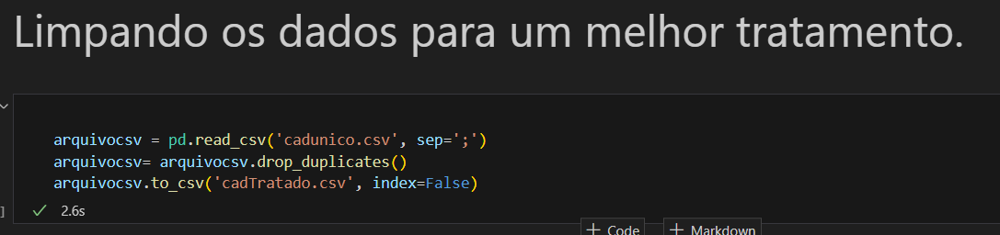
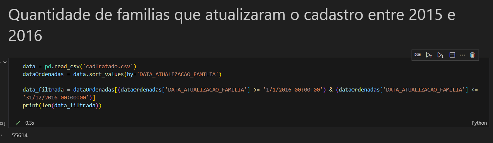
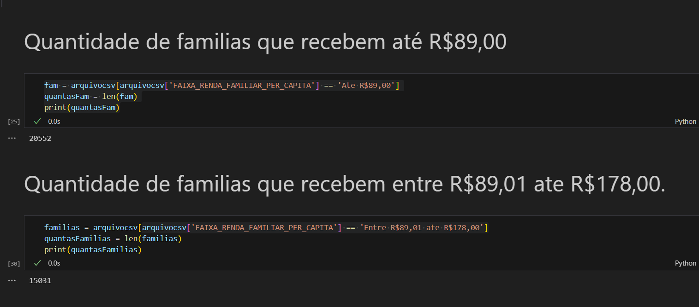
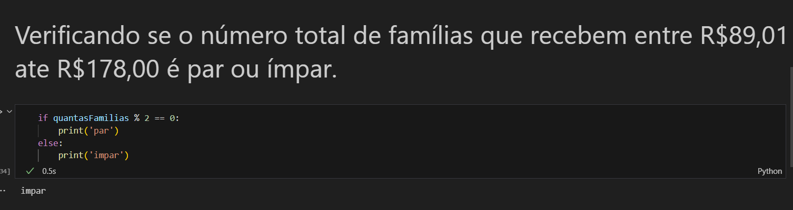
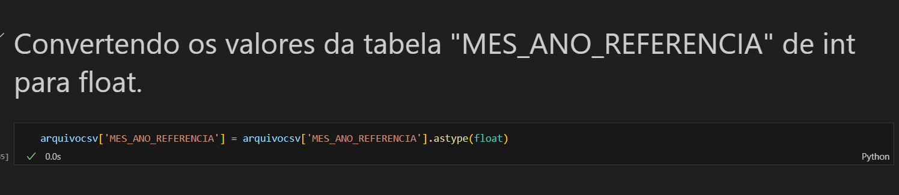
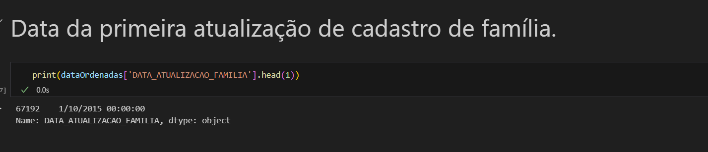
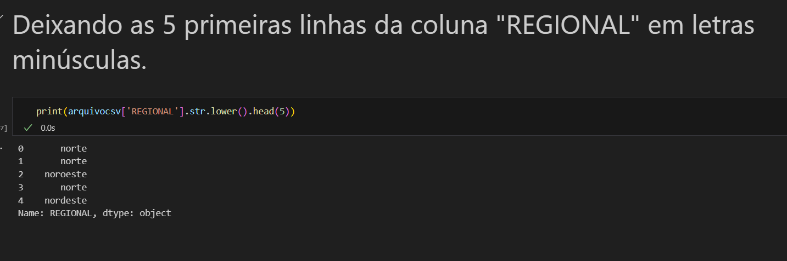

# Divisão do desafio.

O desafio foi dividido em algumas pastas e arquivos. Na pasta "[bucket](bucket)" eu tenho o script utilizado para enviar o arquivo "cadunico.csv" e a pasta "dados" para o bucket "desafiojhoan".
O arquivo "[cadunico.csv](cadunico.csv)" é o arquivo que eu peguei no site "dados.gov.br" para a execução do desafio.
O arquivo "[cadTratado.csv](cadTratado.csv)" é o arquivo final com todos os tratamentos.
O arquivo "[tratamento.ipynb](tratamento.ipynb)" é onde então todos os scripts python que eu utilizei para tratar o aquivo.
Por fim. A pasta "[bucket2](bucket2)" está o script para mandar o arquivo tratado para o bucket "desafiojhoann"

Agora vamos para o passo a passo da execução do desafio.

# Etapa 1 - Enviando arquivo para o bucket.

Eu comecei o desafio criando um bucket na AWS e enviando o arquivo que eu utilizei no desafio pra dentro do bucket. Para fazer isso eu utilizei o script python acima. No script eu começo importando a biblioteca "boto3", que é a biblioteca oficial para serviços da AWS no python. Depois disso eu informo a região "us-east-1" que é a região que o meu bucket está. Depois eu crio um cliente s3 com o "boto3.client" e coloco na variável s3_client. Depois eu dou um nome para o bucket, um nome para o arquivo e o caminho do objeto. Após isso, o script ira tentar criar um bucket na AWS caso não exista nenhum com o nome informado com o "head_bucket", como o bucket já existe, irá aparecer a mensagem da linha logo após no terminal "Bucket desafiojhoann já existe.". Depois de tudo isso, finalmente o arquivo é enviado para o bucket com o "upload_file" que caso envie corretamente irá aparecer uma menssagem de sucesso, caso contrário, uma menssagem de erro.

Acima, temos o upload sendo executado corretamente. Eu também tive que utilizar as chaves de acesso da AWS pra poder dar certo.

# Etapa 2 -  Tratando o arquivo csv.

Na etapa dois eu começo o tratamento do meu arquivo, eu fiz isso utilizando o jupyter notebook e a biblioteca pandas do python.

Na imagem acima, temos o começo do script, nele eu estou importando a biblioteca pandas, ela é uma das principais se não for a principal biblioteca para tratamento de dados.

Logo depois, eu dei uma limpada no meu arquivo para conseguir lidar com ele da melhor forma. Eu apenas lí o arquivo com o "pd.read_csv" e coloquei dentro da variável "arquivocsv", depois eu removi as linhas duplicadas com o "drop_duplicates()" e depois coloquei tudo dentro do arquivo "cadTratado.csv".

O meu arquivo é sobre as famílias cadastradas no Cadastro Único do governo, então para a primeira etapa do desafio que pedia para usar dois operadores lógicos, eu filtrei a quantidade de famílias que atualizaram seu cadastro entre 2015 e 2016. Para fazer isso, primeiro eu abri o arquivo já tratado "cadTratado.csv" e joguei dentro da variável "data", depois eu ordenei pela data utilizando o "sort_values", depois eu ordenei pelas datas onde a coluna "DATA_ATUALIZACAO_FAMILIA" fosse ">= 01/01/2016 & <= 31/12/2016" depois eu dei um "len" na data filtrada para contar de um por um e imprimi o resultado na tela.

Depois foi pedido para fazer duas funções de agregação, a primeira que eu fiz foi a de total de familias que tem renda de até R$89,00. Para fazer isso, do meu arquivo csv,eu paguei apenas as linhas da coluna "FAIXA_RENDA_FAMILIAR_PER_CAPITA" que fossem iguais a "Ate R$89,00", joguei tudo isso dentro da variável "fam" e dei um "len" nela para contar de um por um e imprimi o resultado total na tela. Para a segunda função de agregação, eu peguei a quantidade de famílias que recebem entre R$89,01 ate R$178,00, para fazer isso, eu utilizei o mesmo script anterior, o que mudou foi só o conteúdo da linha que é "Entre R$89,01 ate R$178,00".

Na próxima etapa, foi pedido para fazer uma função condicional, eu verifique se o número total de famílias que tem renda total entre R$89,01 ate R$178,00 é par ou ímpar, para fazer isso, eu peguei a variável "quantasFamilias" que estava armazenado o total de famílias e verifiquei de o resto da divisão por dois era igual a zero, caso ele fosse, seria imprimido "par" se não "impar".

Depois foi pedido para criar uma função de conversão, eu peguei a coluna "MES_ANO_REFERENCIA" do meu arquivo que era do tipo inteira e converti para float utilizando o "astype(float)".

Na função de data pedida, eu peguei a data da primeira atualização de cadastro de família, para fazer isso, eu peguei a minha variável "dataOrdenada" que eu já tinha tratado anteriormente e limitei a uma linha utilizando o "head(1)".

Por fim, na função de string, eu peguei a coluna "REGIONAL" e deixei todo o seu conteúdo em letras minúsculas, para fazer isso, eu peguei o meu arquivo csv tratado, dele eu peguei apenas a coluna "REGIONAL" e dei um "lower()" nela, para não ficar muito grande, eu limitei a 5 linhas utilizando o "head(5)".

## E esta foi a minha execução do desafio, foi uma sprint bem diferente pra mim, ví mais a fundo os conceitos da AWS, acho que não fiz uma boa sprint comparado com as anteriores, mas pretendo melhorar na próxima se for possível continuar.

