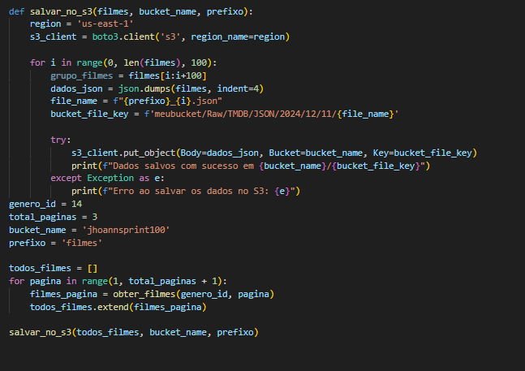
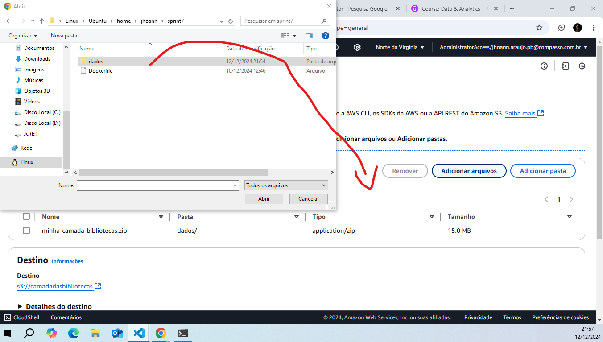

# Etapa 1 - Script.

Na primeira etapa do desafio eu comecei criando o script que pega os dados do TMDB, no começo do código eu começo importando as bibliotecas que foram necessárias  para isso, que foram as "requests" e "boto3". A biblioteca "requests" foi a biblioteca que eu utilizei para fazer a requisição HTTP. Já a boto3 interage com o cliente s3 da AWS, assim eu posso enviar arquivos para um bucket da AWS.

A variável "api_key" contém a chave API de usuário da minha conta no TMDB. para conseguir pega-la eu tive que criar uma conta no TMDB e criar uma chave de API lá dentro, o que foi um processo bem tranquilo. A variável "genero_id" está recebendo o id do gênero dos filmes que eu quero procurar dentro do TMDB, no meu caso o id 14, que é do gênero "Fantasia". E a "url" constrói uma url para a API da TMDB, incluindo a chave de acesso e o id do gênero especificado.

Nessa parte do script eu crio uma função chamada "obter_filmes" que recebe o id do gênero como parâmetro. Depois eu pego a mesma url que foi criada anteriormente e faço a realização da requisição HTTP usando a biblioteca "requests" e coloco dentro da variável "resposta", por fim eu converot o resultado que está dentro de "resposta" para json e jogo dentro da variável "dados".

Aqui eu criei uma lista chamada "filmes" e depois eu comecei a extrair os dados, com o "for" o script percorre os resultados da API que estão dentro de "dados" e extrai as informações título, data de lançamento, sinopse, poster, popularidade e língua original. Após isso o resultado é armazenado dentro do dicionário "dados_filmes". No final, o "for" adiciona cada dicionário de informações dentro da lista "filmes" e a lista de filmes é convertida para JSON.

Após a coleta dos dados é hora de enviar para o bucket S3. Eu começo informando a região e depois eu crio o client S3 com o "boto3.client", depois eu dou um nome para o arquivo, informo o nome do bucket e a estrutura de pastas em que o arquivo json deve ficar dentro do bucket. Com o "put_object" eu envio os dados que estão na variável "dados_json", informo o bucket que eu quero enviar e o formato que ele deve ficar dentro do bucket. Caso seja enviado corretamente aparecerá uma menssagem de sucesso, caso dê erro irá aparecer uma mensagem de erro.

# Etapa 2 - Crinado função no AWS Lambda.

Eu crio a função no AWS Lambda do zero, dou o nome de "desafiosprint7", coloco o tempo de execução "python 3.13" e escolho a arquietura "x86_64", após definir essas opções eu clico em criar função, que não aparece na imagem mas está logo abaixo.

Após criar a função, em código, a própria função cria um scriptzinho para eu inserir o meu script, em "# TODO implement" eu vou inserir o script que eu criei e testei localmente na minha máquina, vão aparecer alguns erros que eu tive que lidar no decorrer do desafio e vou mostrar como solucionei cada um.

Depois de colocar o meu script na função eu precisei clicar em "deploy" para atualizar o código do editor e depois em "test" para testar a função, como eu ainda não tinha nenhum teste, eu precisei criar um novo e o nomeei de "meuteste".

Quando eu testei o script apareceu um erro, esse erro aparece porque a função não encontrou a bliblioteca "requests". Para a função conseguir encontrar as bibliotecas eu vou precisar criar uma layer com as bilbiotecas necassárias.

# Etapa 3 - Criando Layer.

Para criar a layer, primeiro eu precisei criar uma arquivo Dockerfile usando uma imagem de sistema operacional linux espcífica da Amazon e instalar o python versão 3.9 e uma ferramenta para fazer a compressão dos dados.

Depois eu usei o arquivo dockerfile para criar uma imagem a partir dele, eu dei o nome de "amazonlinuxpython39" para a imagem.

O print acima é para mostrar que a imagem foi criada com sucesso.

Depois de criar a imagem eu executo um container a partir dela usando o comando acima, o parâmetro "-it" é para sinalizar que eu quero abrir imediatamente um shell. Depois disso o prompt de comando irá dizer "bash-5.2#", agora eu vou criar as pastas necessárias que irão receber as bibliotécas necessárias para a layer que eu vou criar.

No print acima eu criei os diretórios necessário e dei um "pwd" no final para mostrar o caminho dos diretórios.

Nos prints acima eu dei os comandos necessários para instalar as bibliotecas "requests" e "boto3". Agora eu vou voltar para o diretório "layer_dir" e compactar o diretório "python".

Usei o comando "zip -r minha-camada-bibliotecas.zip ." para compactar o diretório "python". Agora eu preciso copiar o arquivo compactado do container para a minha máquina local.

Na minha máquina eu abri um novo terminal e naveguei para o diretório onde o dockerfile estava, primeiro eu dei um "docker container ls" para descobrir o id do container que eu tinha executado, depois eu dei um "docker cp d2e365b924e0:/root/layer_dir/minha-camada-bibliotecas.zip ./" para copiar o arquivo zipado dentro do container para a minha máquina local.
Como o arquivo possui mais do que 10mb, a AWS pede que eu faça via S3, então eu fiz upload do arquivo "minha-camada-bibliotecas.zip" para um bucket S3.

Primeiro eu criei um bucket chamado "camadadasbibliotecas".

Depois eu criei um diretório chamado "dados" e movi o arquivo "minha-camada-bibliotecas.zip" para dentro dele.

Por fim, eu joguei a pasta "dados" pra dentro do bucket "camadadasbibliotecas" e carreguei. Agora eu preciso carregar o arquivo zip na Lambda para criar a camada.

De volta para o AWS Lambda, eu clico em "camadas" e depois em "criar camada". Eu dei o nome da camada de "biblioecasLayer" e selecionei a opção de fazer upload de um arquivo do Amazon S3, no Amazon S3 eu copiei a url de objeto e colei onde pede o link do URL do Amazon S3 na criação da camada, depois eu selecionei a arquitetura "x86_64" e em tempos de execução o "Python 3.13", após isso foi só clicar em "criar". Agora eu só preciso adicionar a camada criada na minha função Lambda.

Voltando no AWS Lambda, eu vou em "Funções", escolho a função que eu quero adicionar a camada depois desço até a seção "camadas" e clico em "adicionar camada". Em "escolha uma camada" eu seleciono a opção "Camadas personalizadas, depois escolho a camada "bibliotecasLayer" que foi a que eu criei e na versão "1", por fim eu clico em "Adicionar". Agora eu já posso executar o código.

Agora o Lambda apresentou o erro "Task timed out after 3.00 seconds", esse erro ocorre porque o tempo limite de execução no Lambda por padrão é definido em três segundos.

Para mudar o tempo limite, primeiro eu fui nas configurções da função e em configuração geral eu fui em "editar", em "tempo limite" eu defini em 3min e 0 seg, por fim eu cliquei em salvar.

E agora finalmente o Lambda deixou o script ser executado, mas por mais que o script tenha sido executado, a mensagem que o script imprime no terminal é a de erro, ou seja, o arquivo não foi enviado para o bucket, esse erro ocorreu porque a minha função no Lambda ainda não tem permissão para enviar arquivos para buckets do S3. Agora eu vou dar a permissão necessária para a função.

Primeiro eu vou no AWS IAM, depois em políticas, criar política, json, e em editor de políticas eu coloco a política do print acima e depois clico em próximo.

Eu coloquei o nome da política de "lambdaS3" e por fim cliquei em criar política. Agora eu só preciso adicionar a política na minha função do AWS Lambda.

No console IAM, em Funções eu vou em criar perfil, em caso de uso eu escolho o Lambda, em adicionar permissões eu escolho a política lambdaS3 que eu criei anteriormente, clico em próximo e em criar perfil.

De volta para o AWS Lambda eu vou na minha função, em configuração e depois em permissões, em papel de execução eu clico em editar, em função existente eu escolho o "lambdaS3" que foi a que eu criei, clico em salvar e agora finalmente eu posso executar o script.

De volta para a função Lambda, em código, eu testo novamente o script e agora a menssagem que apareceu foi a de sucesso, agora vamos ver se o arquivo foi corretamente para o bucket.

Por fim, temos o arquivo JSON dentro do meu bucket com o caminho que foi pedido no desafio.

# Essa foi a minha execução do desafio, espero que seja o esperado.