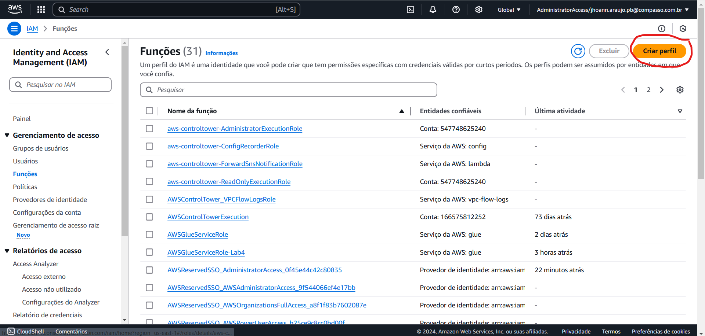
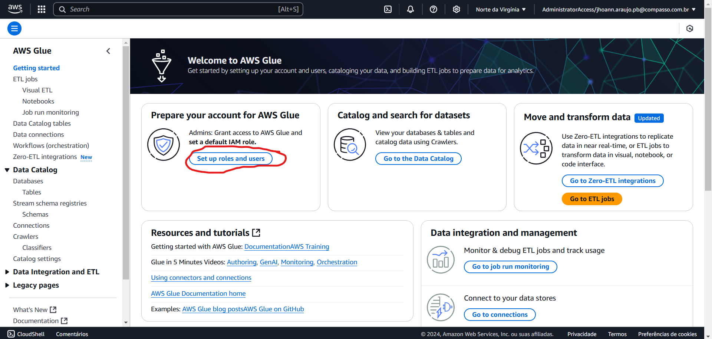
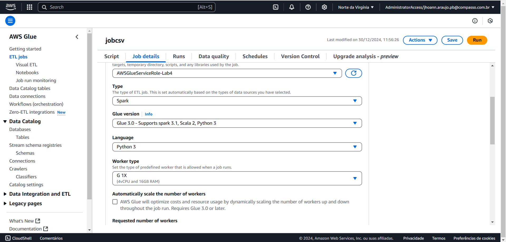
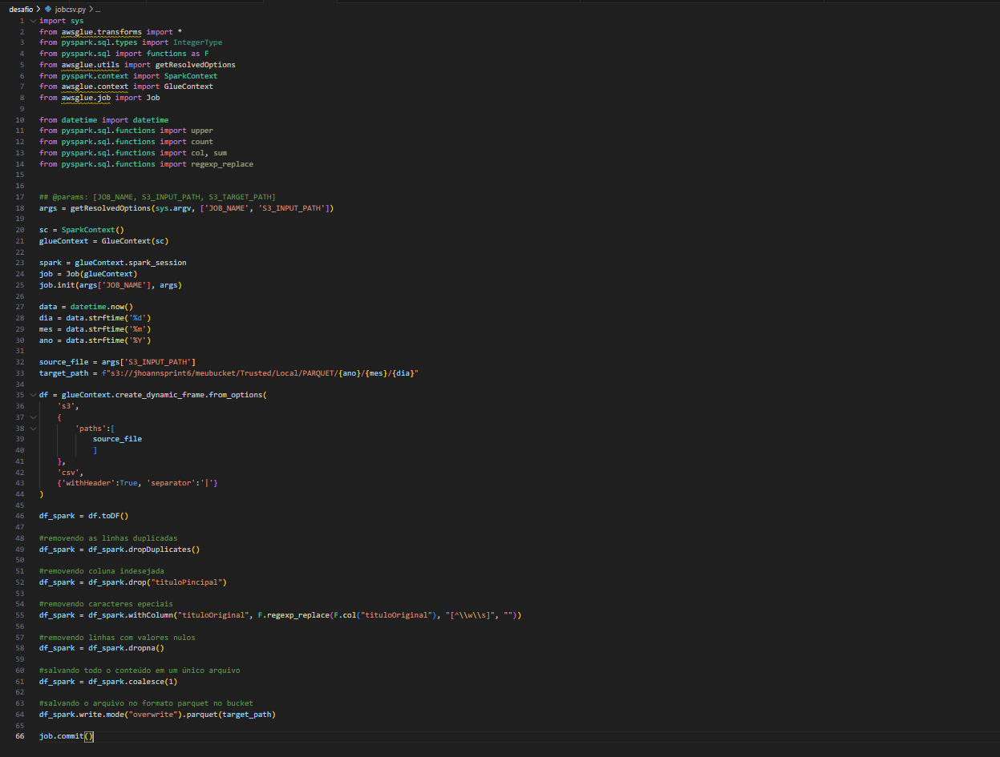
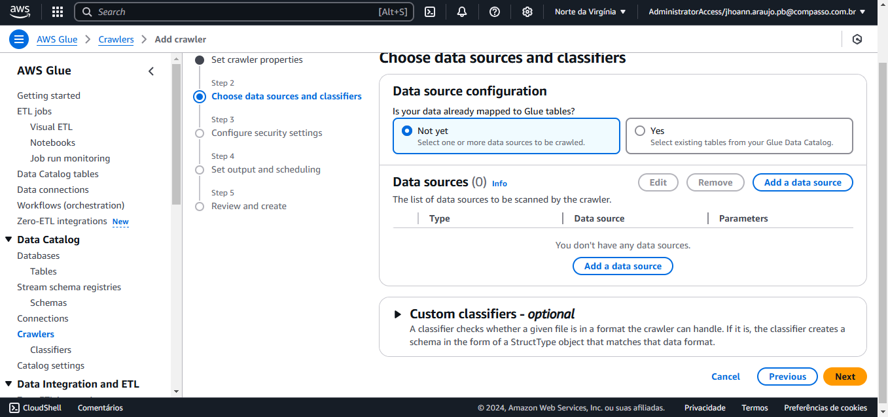

# Etapa-1 Criando Política IAM.

Na primeira etapa do desafio eu precisei criar uma política no AWS IAM para dar permissão pro job do AWS Glue poder mexer no AWS S3. 

Para fazer isso, no AWS IAM, primeiramente eu fui em funções e depois em criar perfil. No perfil eu coloquei as políticas "AmazonS3FullAccess", "AWSLakeFormationDataAdmin", "AWSGlueConsoleFullAccess" e "CloudWatchFullAccess".

# Etapa-2 Configurando AWS Glue.

Nesta etapa eu tive que configurar as permissões no AWS Glue.

No console do AWS Glue eu vou primeiro em "Set up roles and users". Em select Roles eu vou em choose roles e adiciono a Role que eu criei anteriormente, depois eu informo acesso total ao S3 para leitura e escrita, seleciono a caixinha "“Update the standard AWS Glue service role and set it as the default(recommended)" e aplico.

# Etapa-3 Criando o primeiro Job.

Agora eu começo a criar os jobs do AWS Glue. O primeiro é pra lidar com o arquivo CSV.

As configurações foram as seguintes:
Nome: jobcsv;
IAM Role: AWSGlueServiceRole-Lab4 (o que eu criei);
Type: Spark;
Glue version: Glue 3.0;
Language: Python 3;
Worker Type: G 1x;
Opção Automatically scale the number of workers desmarcada;
Requested number of workers: 2;
Number of retries: 0;
Job timeout (minutes): 60;

Em Advanced properties:
Script filename: jobcsv.py;
Spark UI: Desmarcado.
Eu também adicionei o parâmetro "S3_INPUT_TARGET".
As demais opções permaneceram iguais.

Na imagem acima tem o script com todas as limpezas que eu fiz no dataframe, nele eu removi as linhas duplicadas, removi uma coluna indesejada, substituí caracteres especiais, e removi os valores nulos.

Agora eu tenho que criar um segundo job para lidar com o arquivo json extraído do TMDB.
Para a criação do segundo job eu usei praticamente as mesmas configurações do primeiro, as únicas diferenças foram o nome do job (jobtmdb) e os caminhos do target_path e input_path.

# Etapa-4 Criando Crawlers.

Na etapa 4 eu criei crawlers para monitorar o armazenamento de dados do Glue de forma automática.

Eu coloquei o nome do primeiro crawler de "jobcsv", em "Choose data sources and classifiers" eu informei o caminho do S3 a ser monitorado, depois eu coloquei as informações de segurança que eu criei no IAM, em "Target database" eu coloquei a "glue-lab" que eu criei anteriormente e criei o crawler.

A criação do crawler do jobtmbd teve as mesmas configurações do primeiro crawler.

# Essa foi minha execução do desafio.