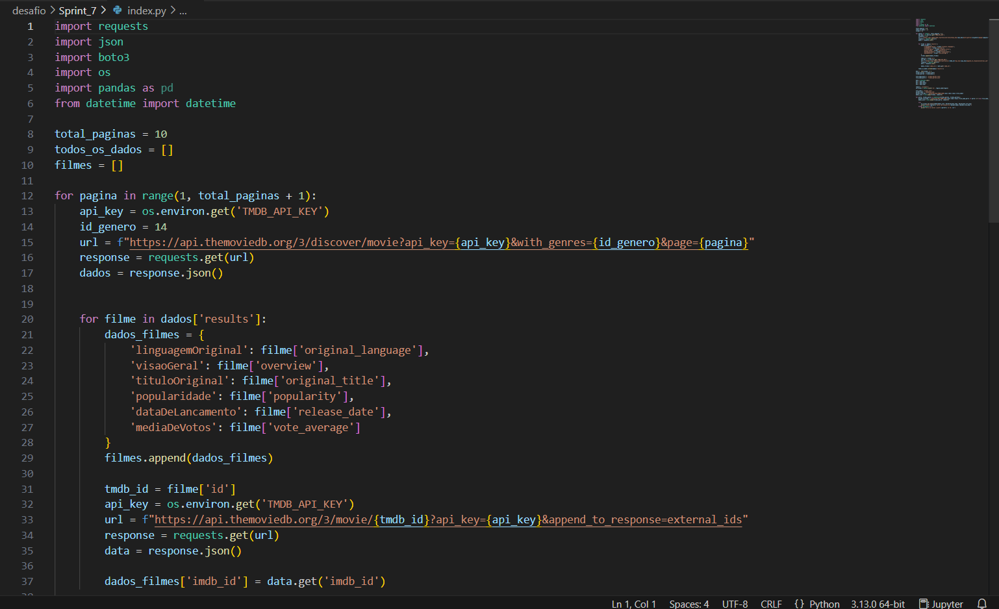
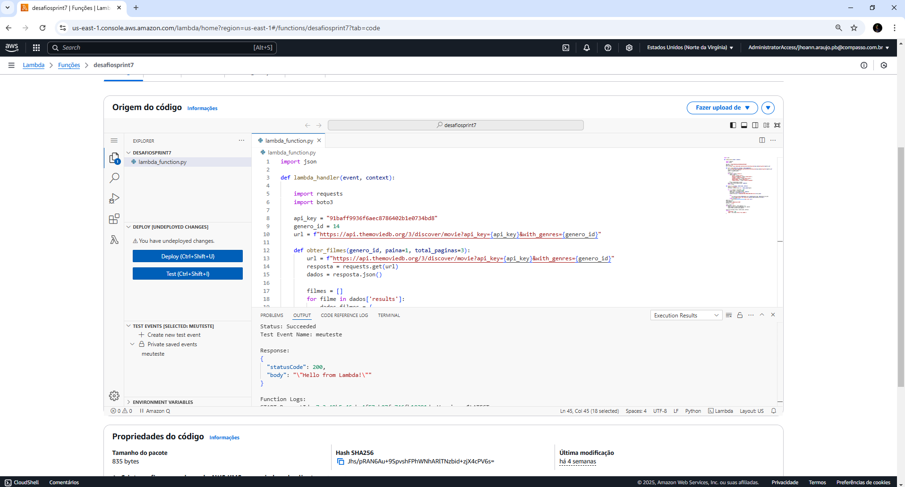
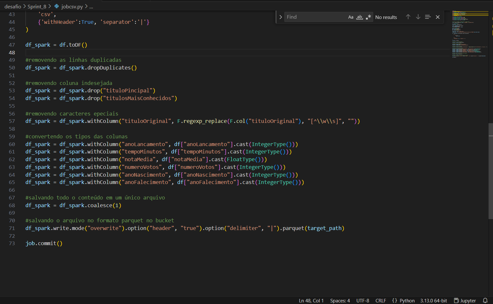
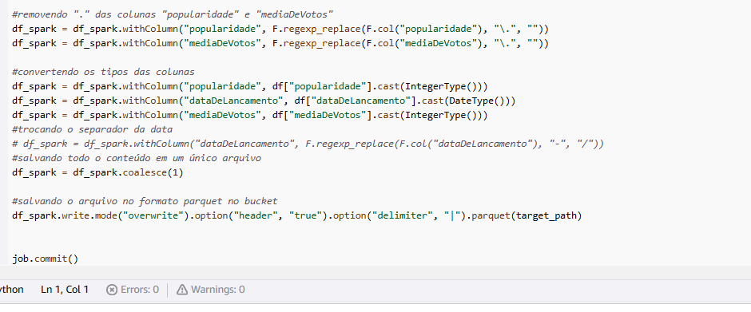
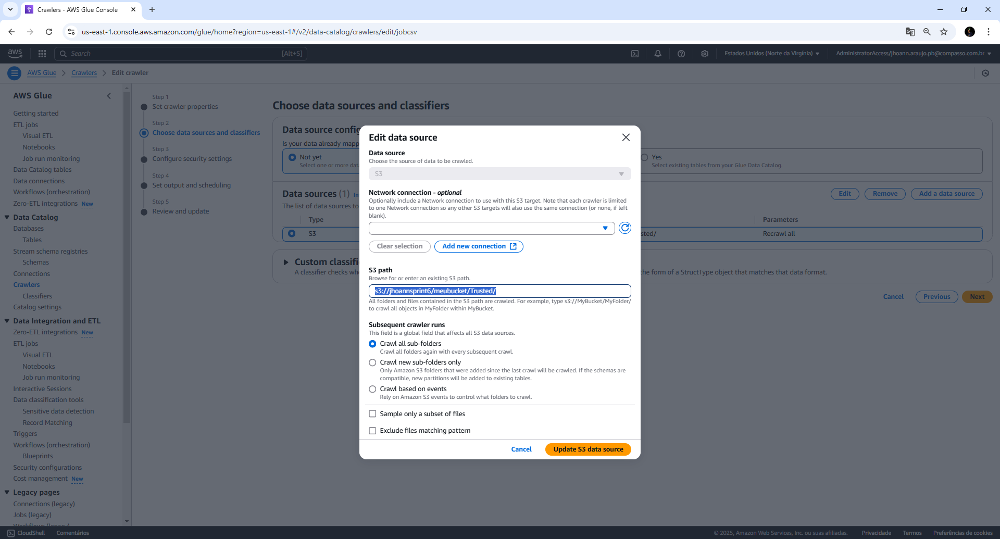
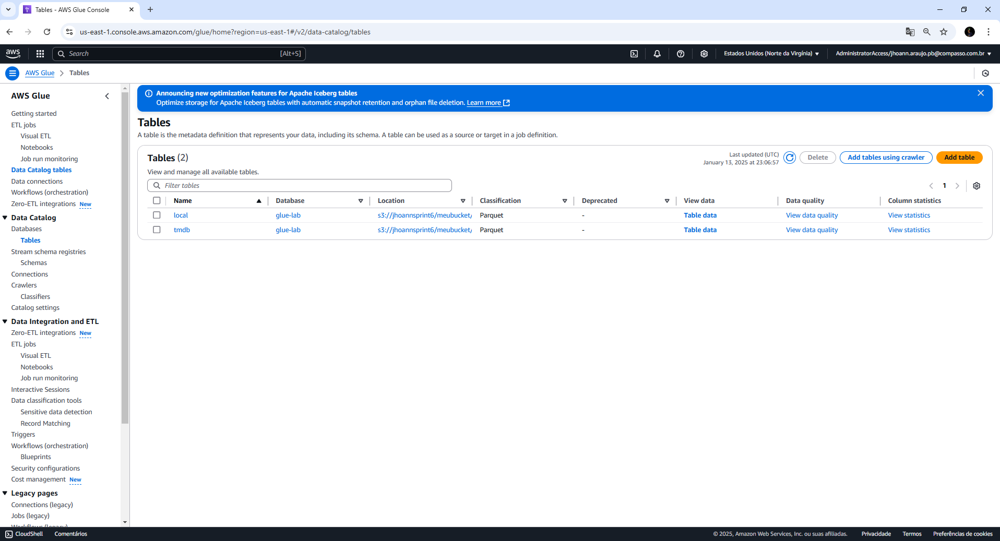

# Voltando nas sprints anteriores.

Na sprint 9 eu tive que voltar nas duas sprints anteriores para corrigir alguns dados e enrriquecer outros.

Vou começar a explicação pelas mudanças da sprint 7.

Na sprint 7 eu comecei mudando o meu script para ingestão de dados do TMDB na trusted zone. O meu script anteiror estava pegando apenas 70 registros de filmes e eu percebi que eram bem poucos.

Depois de testar o meu script localmente e ele funcionar, foi hora de colocar dentro da função do lambda, lá o código também funcionou de primeira, pois foram usadas as mesmas bibliotecas do script anterior e a função também já estava toda configurada, foi preciso fazer apenas a substituição do script.

O script atualizado e os arquivos que ele gerou estão na pasta [Sprint_7](desafio/Sprint_7)

## Essa foi a alteração feita na Sprint 7. Vamos para a sprint 8.

Na sprint 8 eu precisei fazer várias mudanças e até adicionar algumas coisas, devido não ter feito durante a sprint.

Eu comecei alterando o script do job do arquivo local, fazendo alguns tratamentos extras. Nas mudanças eu troquei o tipo de cada coluna e também troquei o delimitador de "," por "|".

No script do tmdb eu fiz a mesma coisa, mudei os tipos das colunas e o delimitador.

Depois de tudo isso foi hora de criar o crawler para criar as duas tabelas. Antes eu estava criando dois crawlers, um para cada tabela.

Depois de estudar um pouco, eu decrobri que eu precisava criar apenas um crawler com o caminho até a camada Trusted, de lá ele iria encontrar as duas tabelas a serem criadas.

Depois de executar o crawler, foram criadas as tabelas "local" e "tmdb" como esperado.

Os scripts alterados estão dentro da pasta [Sprint_8](desafio/Sprint_8).

# Sprint 9.

Sobre a sprint 9, eu explique pra Denise que nessa sprint eu tive que voltar em vários pontos das sprints anteriores, e isso acabou tomando muito do meu tempo. Também tive alguns problemas pessoais que não vêm ao caso. Enfim, eu não consegui nem começar a sprint 9 direito, devido a ter sempre que voltar para resolver alguma coisa. A minha ideia era pedir para fazer tudo o que não fiz na sprint 9 na sprint 10, mas já tinha falado com o Júlio para resolver os problemas das sprints anteriores nessa 9 e não consegui. Eu tentei entregar ainda hoje alguma coisa da sprint 9, mas infelizmente não consegui. Perguntei pra ele se teria alguma possibilidade de eu poder fazer tudo na sprint 10, Mas não tive uma resposta clara se poderia ou não fazer como um "Sim" ou "Não". Enfim, vou dar continuidade na Sprint 9 e tentar fazer o que eu tenho em mente.

